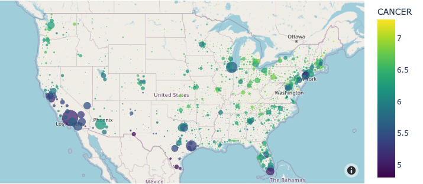

# Hi there, I'm Hale! 

👔 I'm an aspiring data analyst working in customer success and business intelligence for one of America's most influential edtech companies.  

🎯 I completed the data analytics boot camp certificate with Michigan State in November 2022 and am open to analyst roles working in SQL, Python, Tableau, Big Data and Machine Learning.  

📫 You can reach me on [LinkedIn](https://www.linkedin.com/in/halesoyster/)

📊 [Here's](https://b-team-final.herokuapp.com/) the link to our final group project deployed to Heroku, as well as my project [repo](https://github.com/halesoysters/B_Team_Final_Project).  I was responsible for deploying the website to Heroku, coding the interactive visualizations with Plotly, and writing the SQL code to create the tables and host the database using PostgreSQL.  

